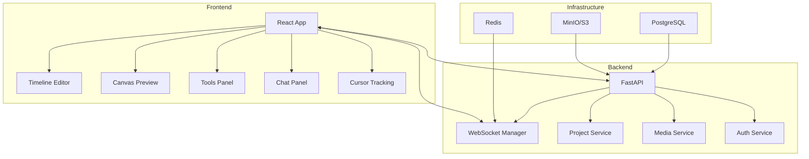

# Collaborative Web-Based Video Editor (MVP) (NOT READY FOR USE)

A real-time collaborative video editing platform where multiple users can edit the same project simultaneously with live synchronization.

## 🎯 Core Features

- **Real-Time Collaboration**: Multiple users editing simultaneously with live cursors and chat
- **Video Editing**: Timeline-based editor with cut, trim, split, merge, transitions, and text overlays
- **Media Management**: Upload and store media in S3-compatible storage
- **Project Management**: Auto-save, version history, and role-based permissions
- **Modern UI**: Responsive React interface with Tailwind CSS

## 🏗️ Architecture



## 🚀 Quick Start

### Prerequisites
- Docker and Docker Compose
- Node.js 18+ (for local development)
- Python 3.11+ (for local development)

### Using Docker (Recommended)
```bash
# Clone the repository
git clone <your-repo-url>
cd collaborative-video-editor

# Copy environment file
cp .env.example .env

# Start all services
docker-compose up -d

# Access the application
# Frontend: http://localhost:3000
# Backend API: http://localhost:8000
# MinIO Console: http://localhost:9001
```

### Local Development
```bash
# Backend
cd backend
python -m venv venv
source venv/bin/activate  # On Windows: venv\Scripts\activate
pip install -r requirements.txt
uvicorn main:app --reload

# Frontend
cd frontend
npm install
npm run dev
```

## 📁 Project Structure

```
collaborative-video-editor/
├── frontend/                 # React + TypeScript + Tailwind
│   ├── src/
│   │   ├── components/      # UI components
│   │   ├── hooks/          # Custom hooks
│   │   ├── stores/         # Zustand state management
│   │   ├── types/          # TypeScript definitions
│   │   └── utils/          # Utility functions
│   ├── package.json
│   └── vite.config.ts
├── backend/                  # FastAPI + SQLAlchemy
│   ├── app/
│   │   ├── api/            # API endpoints
│   │   ├── core/           # Core configuration
│   │   ├── models/         # Database models
│   │   ├── services/       # Business logic
│   │   └── websockets/     # WebSocket handlers
│   ├── requirements.txt
│   └── main.py
├── docker-compose.yml        # Development environment
├── .env.example             # Environment variables template
└── README.md                # This file
```

## 🔧 Configuration

### Environment Variables
- `DATABASE_URL`: PostgreSQL connection string
- `MINIO_ROOT_USER`: MinIO root username
- `MINIO_ROOT_PASSWORD`: MinIO root password
- `JWT_SECRET_KEY`: JWT signing secret
- `AWS_ACCESS_KEY_ID`: S3 access key (for production)
- `AWS_SECRET_ACCESS_KEY`: S3 secret key (for production)
- `AWS_S3_BUCKET`: S3 bucket name

### Database Setup
The application automatically creates necessary tables and indexes on startup.

## 🧪 Testing

### Backend Tests
```bash
cd backend
pytest
```

### Frontend Tests
```bash
cd frontend
npm test
```

## 📚 API Documentation

Once the backend is running, visit:
- **Swagger UI**: http://localhost:8000/docs
- **ReDoc**: http://localhost:8000/redoc

### Key Endpoints
- `POST /api/auth/login` - User authentication
- `POST /api/projects/` - Create new project
- `GET /api/projects/{id}` - Get project details
- `POST /api/media/upload` - Get presigned upload URL
- `WS /ws/project/{id}` - WebSocket connection for real-time collaboration

## 🔒 Security Features

- JWT-based authentication
- Presigned S3 uploads (no direct file uploads to backend)
- Role-based access control
- Input validation with Pydantic models
- CORS configuration for frontend integration

## 🚧 Development Roadmap

### MVP (Current)
- ✅ Basic video editing operations
- ✅ Real-time collaboration
- ✅ Media upload and management
- ✅ Project persistence

### Future Enhancements
- Advanced video effects and filters
- Export pipeline with FFmpeg
- Large session support with SFU
- Mobile-responsive design
- Plugin system for custom effects

## 🤝 Contributing

1. Fork the repository
2. Create a feature branch
3. Make your changes
4. Add tests for new functionality
5. Submit a pull request

## 📄 License

This project is licensed under the MIT License - see the LICENSE file for details.

## 🆘 Support

For issues and questions:
- Create an issue in the repository
- Check the API documentation
- Review the test suite for usage examples

